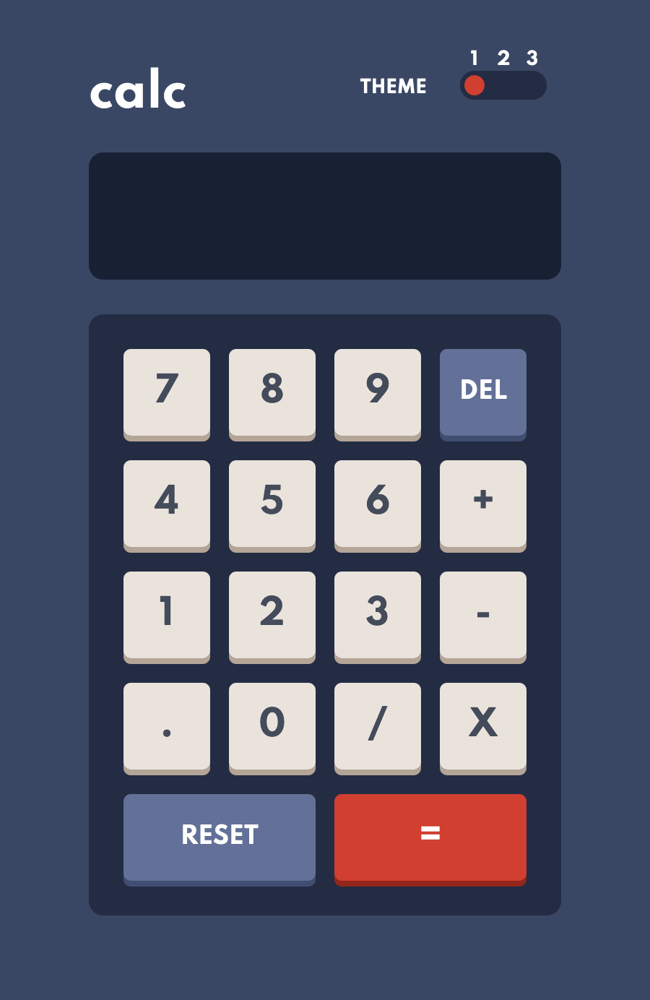

# Frontend Mentor Chalenge: Calculator App

This is my solution to Calculator App challenge on Frontend Mentor. 

## Table of contents

- [Overview](#overview)
  - [The challenge](#the-challenge)
  - [Screenshot](#screenshot)
  - [Links](#links)
- [My process](#my-process)
  - [What I learned](#what-i-learned)
  - [Continued development](#continued-development)
  - [Useful resources](#useful-resources)
- [Acknowledgments](#acknowledgments)

## Overview

### The challenge

The challenge was to build out this calculator app and get it looking as close to the design as possible.

(Challenge.jpg)

### Screenshot

(Screenshot2.png)
(Screenshot3.png)

### Links

- Live Site URL: [Calculator App](https://andyferrie.github.io/Calculator-App/)

## My process

### What I learned

I had great fun building the theme switch from scratch. I managed to make it by lining up 3 radio buttons that change the style class. I learned about browser quirks related to radio buttons and added some Javascript to make sure the default radio button is selected on refreshing the page as Firefox remembers your selection in case you accidentally refresh when filling out forms. 

I also picked up how to make keys looked they are pressed when clicked using styling. Moreover, the keys were the perfect project to practice using grid.

I thought the calculator function would be quite simple but massively underestimated how much goes into making one. To be honest, making it functional is beyond my current JS knowledge so it was very informative to get it all working by following a YouTube tutorial. 

### Continued development

I need to further develop my basic knowledge of Javascript. 

### Useful resources

- [Frontend Mentor](https://www.frontendmentor.io/challenges) - This is the site where the project originates. Frontend mentor is a great resource for challenges using professional looking assets.  
- [Build a Calculator with Javascript Tutorial](https://www.youtube.com/watch?v=j59qQ7YWLxw&t=293s) - I used this tutorial to learn how make the calculator functional using Javascript. 
- [How TO - Custom Checkbox](https://www.w3schools.com/howto/howto_css_custom_checkbox.asp) - I referred to this resource on W3 Schools to learn about styling radio buttons. 
## Acknowledgments

Many thanks to Web Dev Simplified for the useful tutorial on how to make the calculator function with Javascript. You can check out his YouTube channel here: https://www.youtube.com/channel/UCFbNIlppjAuEX4znoulh0Cw